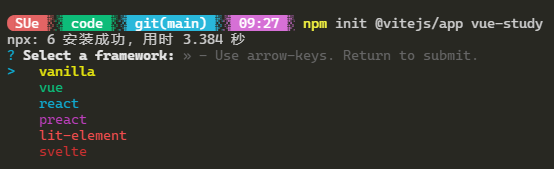
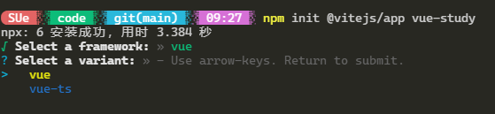
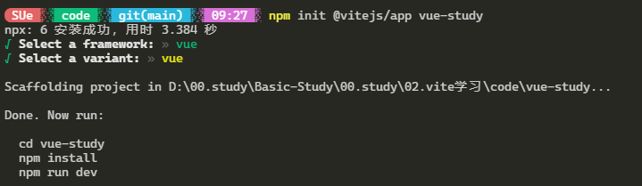
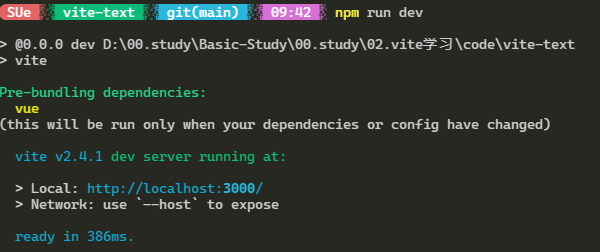

## Vite

`Vite` 这个单词是一个法语单词，意思就是轻快的意思。它和我们一起使用 Vue-cli 的作用基本相同，都是项目初始化构建工具，相当于 Vue 项目构建的第二代产品，当然它也包含了项目的编译功能。需要注意一下 `Vite` 的生产环境下打包是通过 `Rollup` 来完成的，

### 特性特点：

- Vite 主打特点就是轻快冷服务启动。冷服务的意思是，在开发预览中，它是不进行打包的。
- 开发中可以实现热更新，也就是说在你开发的时候，只要一保存，结果就会更新。
- 按需进行更新编译，不会刷新全部 DOM 节点。这功能会加快我们的开发流程度。

### 使用：

在使用 `Vite` 前，你需要知道一点，目前它只支持 `Vue3.x` 的版本，不支持 `Vue2.x` 版本。通俗的理解就是我只服侍高端用户。

先使用 `npm init vite-app` 进行初始化，你可以随便起一个项目名字，比如就叫做 vue-study

这时候项目中并没有安装项目所需要的依赖包，所以你要使用 `npm install` 进行依赖包的安装。 最后直接用 npm run dev 来看看项目是否可以跑起来

```js
npm init @vitejs/app <project-name>
cd <project-name>
npm install
npm run dev
```







如果一切正常，在命令行中，你可以看到如下结果：



### vite 生成目录结构：

```
|-node_modules      -- 项目依赖包的目录
|-public            -- 项目公用文件
  |--favicon.ico    -- 网站地址栏前面的小图标
|-src               -- 源文件目录，程序员主要工作的地方
  |-assets          -- 静态文件目录，图片图标，比如网站logo
  |-components      -- Vue3.x的自定义组件目录
  |--App.vue        -- 项目的根组件，单页应用都需要的
  |--index.css      -- 一般项目的通用CSS样式写在这里，main.js引入
  |--main.js        -- 项目入口文件，SPA单页应用都需要入口文件
|--.gitignore       -- git的管理配置文件，设置那些目录或文件不管理
|-- index.html      -- 项目的默认首页，Vue的组件需要挂载到这个文件上
|-- package-lock.json --项目包的锁定文件，用于防止包版本不一样导致的错误
|-- package.json    -- 项目配置文件，包管理、项目名称、版本和命令
```

### vite 中使用 Typescript、sass

#### Typescript

只要在`<script>`标签中加入 `lang=ts` 就可以了。

如果在 `vite` 配置项中没有选择 `vue-ts` 的话需安装

```js
yarn add --dev typescript
```

在 项目根目录下创建 typescript 的配置文件 `tsconfig.json`

```json
{
  "compilerOptions": {
    // 允许从没有设置默认导出的模块中默认导入。这并不影响代码的输出，仅为了类型检查。
    "allowSyntheticDefaultImports": true,

    // 解析非相对模块名的基准目录
    "baseUrl": ".",

    "esModuleInterop": true,

    // 从 tslib 导入辅助工具函数（比如 __extends， __rest等）
    "importHelpers": true,

    // 指定生成哪个模块系统代码
    "module": "esnext",

    // 决定如何处理模块。
    "moduleResolution": "node",

    // 启用所有严格类型检查选项。
    // 启用 --strict相当于启用 --noImplicitAny, --noImplicitThis, --alwaysStrict，
    // --strictNullChecks和 --strictFunctionTypes和--strictPropertyInitialization。
    "strict": true,

    // 生成相应的 .map文件。
    "sourceMap": true,

    // 忽略所有的声明文件（ *.d.ts）的类型检查。
    "skipLibCheck": true,

    // 指定ECMAScript目标版本
    "target": "esnext",

    // 要包含的类型声明文件名列表
    "types": [],

    "isolatedModules": true,

    // 模块名到基于 baseUrl的路径映射的列表。
    "paths": {
      "@/*": ["src/*"]
    },
    // 编译过程中需要引入的库文件的列表。
    "lib": ["ESNext", "DOM", "DOM.Iterable", "ScriptHost"]
  },
  "include": [
    "src/**/*.ts",
    "src/**/*.tsx",
    "src/**/*.vue",
    "tests/**/*.ts",
    "tests/**/*.tsx"
  ],
  "exclude": ["node_modules"]
}
```

在 src 目录下新加 shim.d.ts 文件

```ts
/* eslint-disable */
import type { DefineComponent } from "vue";

declare module "*.vue" {
  const component: DefineComponent<{}, {}, any>;
  export default component;
}
```

把 main.js 修改成 main.ts

在根目录，打开 Index.html

```html
<script type="module" src="/src/main.js"></script>
<!-- 修改为： -->
<script type="module" src="/src/main.ts"></script>
```

#### SASS

作中使用 SASS 编写样式也是常见的。SCSS 算是一种预处理器`(per-Processors)`,`Vite` 对这种预处理器支持只是在最新的浏览器中（比如 Chrome）,所以它推荐你使用原生的 CSS。
首先下载 scss，sass-loader，sass

```
npm install --save-dev sass-loader
npm install --save-dev node-sass
npm install --save-dev sass
```

scss 全局配置在 `vite.config.ts`：

```ts
css: {
  preprocessorOptions: {
    scss: {
      // 配置公共的scss样式
      additionalData: `@import "./src/assets/scss/global.scss";`;
    }
  }
}
```

然后在 `<script>` 标签下加入 `<style>` 标签，便签属性加 `lang="scss"`。

### vite 配置文件等

建立配置文件:

在根目录下面建立一个 vite.config.ts 文件，在里面导出一个`对象`或者是一个`函数`返回一个对象都可以，例如下下面：

```ts
export default {
	配置1：'',
	配置2: '',
}
```

或者：

```ts
import { defineConfig } from "vite";
import vue from "@vitejs/plugin-vue";

// https://vitejs.dev/config/
export default defineConfig({
  plugins: [vue()],
});
```

**常用的配置文件：**

```ts
const path = require("path");
export default function () {
  return {
    // 代理，最重要，其他的都可以有默认配置
    proxy: {
      "/api": {
        target: "http://localhost:3000",
        changeOrigin: true,
      },
    },
    // 项目启动的根路径
    root: "G:\\work\\myself\\studyNode\\nodeMysql\\client",
    // 入口
    entry: "index.html",
    // 出口
    outDir: "./../public",
    // 打包后的跟路径
    base: "/",
    // 输出的静态资源的文件夹名称
    assetsDir: "assets",
    // 是否开启ssr服务断渲染
    ssr: false,
    // 重命名路径  path.resolve(__dirname, './src')
    alias: {
      "/@/": path.resolve(__dirname, "./src"),
    },
    // 端口
    port: 3002,
    // 是否自动开启浏览器
    open: false,
    // 开启控制台输出日志
    silent: false,
    // 哪个第三方的包需要重新编译
    optimizeDeps: [],
  };
}
```

**配置详情如下：**

````ts
 /**
   * Entry. Use this to specify a js entry file in use cases where an
   * `index.html` does not exist (e.g. serving vite assets from a different host)
   * @default 'index.html'
   * 入口
   */
  entry: string

  /**
   * Base public path when served in production.
   * @default '/'
   * 根路径 默认是'/'
   */
  base: string

  /**
   * Directory relative from `root` where build output will be placed. If the
   * directory exists, it will be removed before the build.
   * @default 'dist'
   * 输出的默认目录
   */
  outDir: string

  /**
   * Directory relative from `outDir` where the built js/css/image assets will
   * be placed.
   * @default '_assets'
   * 静态资源目录
   */
  assetsDir: string

  /**
   * Static asset files smaller than this number (in bytes) will be inlined as
   * base64 strings. Default limit is `4096` (4kb). Set to `0` to disable.
   * @default 4096
   * 每个静态资源的最小大小 默认 4096字节
   */
  assetsInlineLimit: number

  /**
   * Whether to code-split CSS. When enabled, CSS in async chunks will be
   * inlined as strings in the chunk and inserted via dynamically created
   * style tags when the chunk is loaded.
   * @default true
   * 默认开启css分隔
   */
  cssCodeSplit: boolean

  /**
   * Whether to generate sourcemap
   * @default false
   * 是否开启siurcemap
   */
  sourcemap: boolean | 'inline'

  /**
   * Set to `false` to disable minification, or specify the minifier to use.
   * Available options are 'terser' or 'esbuild'.
   * @default 'terser'
   */
  minify: boolean | 'terser' | 'esbuild'
  /**
   * The option for `terser`
   */
  terserOptions: RollupTerserOptions
  /**
   * Transpile target for esbuild.
   * @default 'es2020'
   * es构建的目标
   */
  esbuildTarget: string

  /**
   * Build for server-side rendering, only as a CLI flag
   * for programmatic usage, use `ssrBuild` directly.
   * @internal
   * 是否开始ssr服务断渲染
   */
  ssr?: boolean

  // The following are API / config only and not documented in the CLI. --------
  /**
   * Will be passed to rollup.rollup()
   *
   * https://rollupjs.org/guide/en/#big-list-of-options
   * 由于vite的打包使用的是rollup 所以该配置是rollup的输入配置
   */
  rollupInputOptions: ViteRollupInputOptions

  /**
   * Will be passed to bundle.generate()
   *
   * https://rollupjs.org/guide/en/#big-list-of-options
   * 该配置是rollup的输出配置
   */
  rollupOutputOptions: RollupOutputOptions

  /**
   * Will be passed to rollup-plugin-vue
   *
   * https://github.com/vuejs/rollup-plugin-vue/blob/next/src/index.ts
   */
  rollupPluginVueOptions: Partial<RollupPluginVueOptions>
  /**
   * Will be passed to @rollup/plugin-node-resolve
   * https://github.com/rollup/plugins/tree/master/packages/node-resolve#dedupe
   */
  rollupDedupe: string[]
  /**
   * Whether to log asset info to console
   * @default false
   * 是否开启日志在控制台的输出， 默认为false
   */
  silent: boolean

  /**
   * Whether to write bundle to disk
   * @default true
   * 是否将打包好的bundle写入磁盘，默认为true
   */
  write: boolean
  /**
   * Whether to emit index.html
   * @default true
   * 是否需要打包出index.html文件
   */
  emitIndex: boolean
  /**
   * Whether to emit assets other than JavaScript
   * @default true
   * 是否打包分出除了javascripe的包
   */
  emitAssets: boolean

  /**
   * Whether to emit a manifest.json under assets dir to map hash-less filenames
   * to their hashed versions. Useful when you want to generate your own HTML
   * instead of using the one generated by Vite.
   *
   * Example:
   *
   * ```json
   * {
   *   "main.js": "main.68fe3fad.js",
   *   "style.css": "style.e6b63442.css"
   * }
   * ```
   * @default false
   */
  emitManifest?: boolean
  /**
   * Predicate function that determines whether a link rel=modulepreload shall be
   * added to the index.html for the chunk passed in
   */
  shouldPreload: ((chunk: OutputChunk) => boolean) | null
  /**
   * Enable 'rollup-plugin-vue'
   * @default true
   */
  enableRollupPluginVue?: boolean


/**
   * Project root directory. Can be an absolute path, or a path relative from
   * the location of the config file itself.
   * @default process.cwd()
   * 项目的根路径，默认是process.cwd(),就是项目的根路径，到src的上一层目录，一般不配置，使用默认的就好
   */
  root?: string

  /**
   * Import alias. The entries can either be exact request -> request mappings
   * (exact, no wildcard syntax), or request path -> fs directory mappings.
   * When using directory mappings, the key **must start and end with a slash**.
   *
   * Example `vite.config.js`:
   * ```js
   * module.exports = {
   *   alias: {
   *     // alias package names
   *     'react': '@pika/react',
   *     'react-dom': '@pika/react-dom'
   *
   *     // alias a path to a fs directory
   *     // the key must start and end with a slash
   *     '/@foo/': path.resolve(__dirname, 'some-special-dir')
   *   }
   * }
   * ```
   * 重命名路径，默认必须要 //包裹  如：'/@foo/': path.resolve(__dirname, 'some-special-dir')， 用于项目中的文件路径的别名
   */
  alias?: Record<string, string>

  /**
   * Function that tests a file path for inclusion as a static asset.
   * 默认需要一个函数，返回文件路径中是否包含静态资源，目前的作用我也不知道
   */
  assetsInclude?: (file: string) => boolean

  /**
   * Custom file transforms.
   * 自定义文件转换
   */
  transforms?: Transform[]

  /**
   * Custom index.html transforms.
   * 自定义index.html转换
   */
  indexHtmlTransforms?: IndexHtmlTransform[]

  /**
   * Define global variable replacements.
   * Entries will be defined on `window` during dev and replaced during build.
   * 定义一个全局的变量替换，在生产环境中将会替换开发环境的遍历，
   */
  define?: Record<string, any>

  /**
   * Resolvers to map dev server public path requests to/from file system paths,
   * and optionally map module ids to public path requests.
   * 解析器
   */
  resolvers?: Resolver[]

  /**
   * Configure dep optimization behavior.
   *
   * Example `vite.config.js`:
   * ```js
   * module.exports = {
   *   optimizeDeps: {
   *     exclude: ['dep-a', 'dep-b']
   *   }
   * }
   * ```
   * 引入第三方的配置，不需要重新打包
   */
  optimizeDeps?: DepOptimizationOptions

  /**
   * Options to pass to `@vue/compiler-dom`
   *
   * https://github.com/vuejs/vue-next/blob/master/packages/compiler-core/src/options.ts
   * vue的编译器的配置
   */
  vueCompilerOptions?: CompilerOptions

  /**
   * Configure what tags/attributes to trasnform into asset url imports,
   * or disable the transform altogether with `false`.
   * 配置哪些标签/属性以url的形式导入
   */
  vueTransformAssetUrls?: SFCTemplateCompileOptions['transformAssetUrls']

  /**
   * The options for template block preprocessor render.
   * 模板块预处理器渲染的配置
   */
  vueTemplatePreprocessOptions?: Record<
    string,
    SFCTemplateCompileOptions['preprocessOptions']
  >
  /**
   * Transform functions for Vue custom blocks.
   *
   * Example `vue.config.js`:
   * ```js
   * module.exports = {
   *   vueCustomBlockTransforms: {
   *     i18n: src => `export default Comp => { ... }`
   *   }
   * }
   * ```
   * vue自定义模块的转换
   */
  vueCustomBlockTransforms?: Record<string, CustomBlockTransform>

  /**
   * Configure what to use for jsx factory and fragment.
   * @default 'vue'
   * jsx的模板选择，默认是vue
   */
  jsx?:
    | 'vue'
    | 'preact'
    | 'react'
    | {
        factory?: string
        fragment?: string
      }

  /**
   * Environment mode
   * 环境模式
   */
  mode?: string

  /**
   * CSS preprocess options
   * css 的预设配置
   */
  cssPreprocessOptions?: CssPreprocessOptions

  /**
   * CSS modules options
   * css模块配置
   */
  cssModuleOptions?: SFCAsyncStyleCompileOptions['modulesOptions']

  /**
   * Enable esbuild
   * @default true
   * 是否使用es构建， 默认为true
   */
  enableEsbuild?: boolean
  /**
   * Environment variables parsed from .env files
   * only ones starting with VITE_ are exposed on `import.meta.env`
   * @internal
   * 环境变量
   */
  env?: DotenvParseOutput

  /**
   * Configure hmr websocket connection.
   * 配置websocket的连接，应该是用于热加载的吧
   */
  hmr?: HmrConfig | boolean
  /**
   * Configure dev server hostname.
   * 配置主机名称
   */
  hostname?: string
  // 配置端口
  port?: number
  // 配置是否自动打开浏览器
  open?: boolean
  /**
   * Configure https.
   * 是否使用https
   */
  https?: boolean

  // https的配置
  httpsOptions?: ServerOptions

  /**
   * Configure custom proxy rules for the dev server. Uses
   * [`koa-proxies`](https://github.com/vagusX/koa-proxies) which in turn uses
   * [`http-proxy`](https://github.com/http-party/node-http-proxy). Each key can
   * be a path Full options
   * [here](https://github.com/http-party/node-http-proxy#options).
   *
   * Example `vite.config.js`:
   * ```js
   * module.exports = {
   *   proxy: {
   *     // string shorthand
   *     '/foo': 'http://localhost:4567/foo',
   *     // with options
   *     '/api': {
   *       target: 'http://jsonplaceholder.typicode.com',
   *       changeOrigin: true,
   *       rewrite: path => path.replace(/^\/api/, '')
   *     }
   *   }
   * }
   * ```
   * 配置代理
   */
  proxy?: Record<string, string | ProxiesOptions>

````
