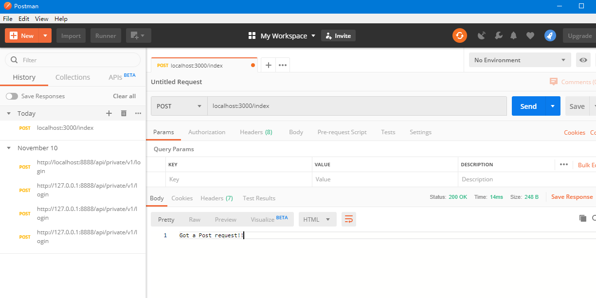

### Express 是什么

`Express` 是一个快速，简单，极简的 Node.js web 应用开发框架。
通过它，可以构建 web 应用（后台）。Ex:

- 接口服务
- 传统的 web 网站
- 开发工具集成等
  ...

`Express` 本身是极简的。仅提供了 web 开发的基础功能，但是它通过中间的方式继承了许多的外部插件来处理 HTTP 请求。

- `body-parser`: 解析 HTTP 请求体。
- `compression`: 压缩 HTTP 相应。
- `cookie-parser`: 解析 cookie 数据。
- `cors`: 处理跨域资源请求。
- `morgan`: HTTP 请求日志记录。
  ...

`Express` 中间件的特性固然强大，但是它提供的灵活性是一把双刃剑。

- 它让 Express 本身变得更加灵活和简单。
- 缺点是在于虽然有一些中间包可以解决几乎所有问题或需求，但是挑选是个问题。

`Express` 不对 Node.js 已有的特性进行二次抽象，只是在它之上扩展了 web 应用所需的基本功能。

- 内部使用的还是 http 模块。
- 请求对象继承自：`http.IncomingMessage`
- 响应对象继承自：`http.ServerResponse`
  ...

`Express`基于其而创建的框架：

- Nest.js
- Koa.js
  ...

### Express 特性

- 简单易学
- 丰富的基础 API 支持，以及常见的 HTTP 辅助程序，Ex：重定向、缓存等
- 路由功能
- 灵活的中间件
- 高性能
- 稳定
- 支持 14 个主流模板
  ...

### Express 应用场景

- 传统的 Web 网站
  - Ghost
  - ...
- 接口服务
- 服务端渲染中间层
- 开发工具
  - JSON Server
  - webpack-dev-server

[Awesome Express：集成了所有 express 中需要用到的东西](https://github.com/wabg/awesome-express)

### Express 基本使用

```js
// 引入 express 模块
const express = require("express");
// 创建服务
const app = express();

// 创建接口
app.get("/", (req, res) => {
  // req：request 请求对象
  // res：response 响应对象
  res.send("Hello World");
});

// 监听端口
app.listen(3000, () => {
  console.log("Server running at Http://localhost:3000");
});
```

### Express 路由基础

路由时指定确定应用程序如何相应客户端对特定端点的请求，该特定端点时 URI（或路径）和特定的 HTTP 请求方法（GET、POST 等）。

每个路由可以具有一个或者多个处理程序函数，这些函数在匹配该路由时执行。

路由定义采用以下结构：

```js
app.METHOD(path, handler);
```

- app 是 Express 实例
- Method 是 http 请求
- path 代表路径
- handler 代表路由匹配成功时执行的功能

**get 方法请求根路径路径**

```js
pp.get("/", (req, res) => {
  res.send("Hello World");
});
```

**post 方法请求路径**

`post` 请求是无法在地址栏中直接写的，必须以表单的形式去发起请求才行。

所以使用 `postman` 进行请求测试

```js
app.post("/index", (req, res) => {
  res.send("Got a Post request!!");
});
```



**put 方法请求路径**

```js
app.put("/user", (req, res) => {
  res.send("Got a Put request!!");
});
```


**delete 方法请求路径**

```js
app.delete("/user", (req, res) => {
  res.send("Got a Delete request!!");
});
```


### 请求（request）和响应（response）

`Express` 应用使用路由回调函数的参数：`request` 和 `response` 对象来处理请求和响应的数据。

```js
app.get("/", (request, response) => {
  // ......
});
```

#### 请求对象

`request` 对象代表 HTTP 请求，并据偶请求查询字符串，参数，正文，HTTP 标头等的属性。

1.  `req.params`
    这是一个数组对象，命名过的参数会以键值对的形式存放。 比如你有一个路由/user/:name, "name"属性会存放在 req.params.name. 这个对象默认为 {}.

    > 直接写在地址栏中，控制台就会输出了

    ```js
    app.get("/user/:user", (request, response) => {
      console.log(request.params); //  { user: 'sue' }
    });
    ```

    

2.  `req.query`
    这是一个解析过的请求参数对象，默认为{}.

    ```js
    app.get("/user", (request, response) => {
      console.log(request.query); //  { name: 'sue', age: '18' }
    });
    ```

3.  `req.method`
    获取当前方法

    ```js
    app.get("/", (req, res) => {
      res.send("Hello World");
      console.log(req.method); // Get
    });
    ```

4.  `req.headers`
    获取请求头信息

    ```js
    app.get("/", (req, res) => {
      res.send("Hello World");
      console.log(req.headers);
    });
    //   {
    //   'user-agent': 'PostmanRuntime/7.18.0',
    //   accept: '*/*',
    //   'cache-control': 'no-cache',
    //   'postman-token': 'ececed82-2c50-45ae-aeaf-f96475ebdb90',
    //   host: 'localhost:3000',
    //   'accept-encoding': 'gzip, deflate',
    //   connection: 'keep-alive'
    // }
    ```
