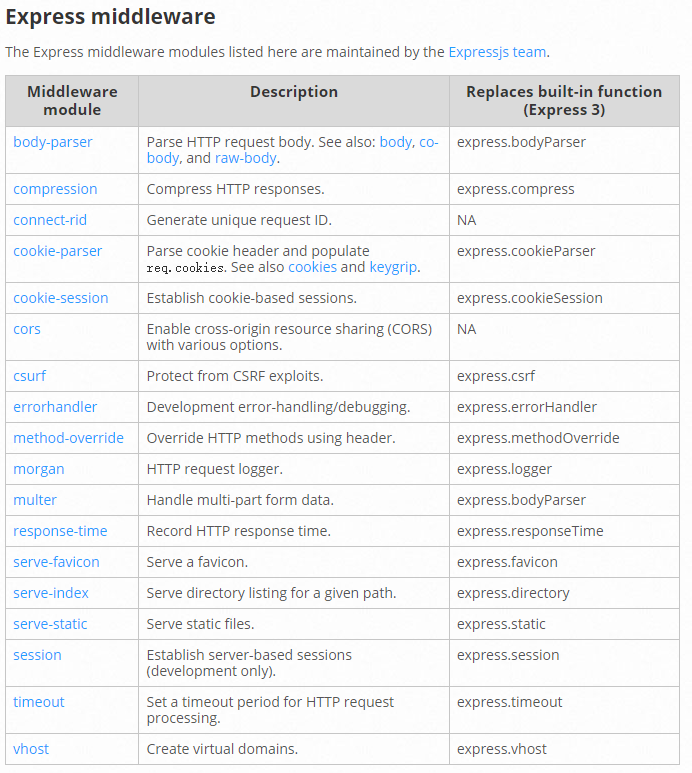
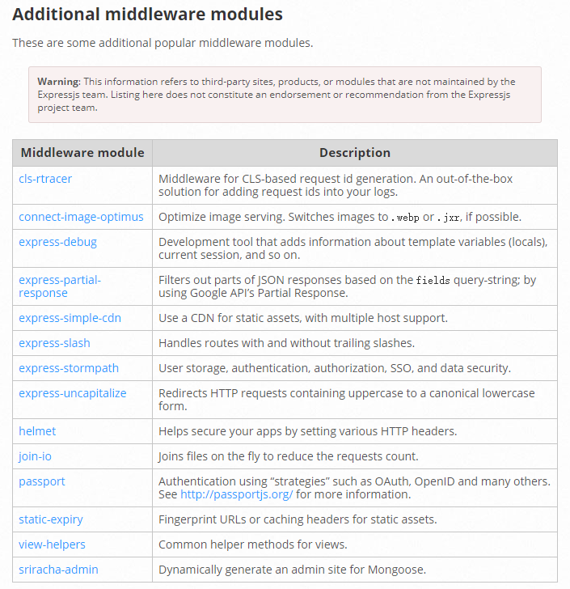

# Express 中间件

## 概念解析：

Express 的最大特色，意识最重要的一个设计，就是中间件。一个 Express 应用，就是由许多的中间件完成的。

Ex：


上图，自来水从获取水源到净化处理交给用户，中间经历了一系列的处理环节，我们称其中的每一个处理环节就是一个中间件。这样做的目的既提高了生产效率也保证了可维护性。

Express 中间件和 AOP **面向切面编程** 就是一个意思，就是都需要经过的一些步骤，**不去修改自己的代码，以此来扩展或者处理一些功能。**

什么是 AOP？

- 中文意思就是面向切面编程。

Ex：
农场的水果包装流水线一开始只有：`采摘`-`清洗`-`贴标签`


为了提高销量，要加上两道工序`分类`和`包装`但是又不能干扰原有的流程，同时如果没有增加收益可以随时撤销新增的工序。


最后在流水线中的空袭插入两个工人去处理，形成`采摘 - 分类 - 清洗 - 包装 - 贴标签`的新流程，而且工人随时可以撤回。

AOP（Aspect Oriented Programming）面向切面编程：

- 将日志记录，性能统计，安全控制，事务处理，异常处理等代码从业务逻辑代码中划分出来，通过对这些行为的分离，我们希望可以将**它们独立到非指导业务逻辑的方法中，进而改变这些行为的时候不影响业务逻辑的代码**
- 利用 AOP 可以对业务逻辑的各个部分进行隔离，从而使得**业务逻辑各部分之间的耦合度降低**，提高**程序的可重用性**，同时**提高了开发的效率和可维护性。**


总结：就是在原有的代码程序中，在程序生命周期或者横向流程中`加入/减去`一个或多个功能，不影响原有功能。

## Express 中的中间件

在 Express 中，中间件就是一个可以访问请求对象、响应对象和调用 next 方法的一个函数。


在中间件函数中可以执行以下任何任务：

- 执行任何代码
- 修改 request 或者 response 响应对象
- 结束请求响应周期
- 调用用下一个中间件

注意：如果当前的中间件功能内有结束请求-相应周期，则必须调用 next（）控制权传递给下一个中间件功能。否则，该请求将被挂起。

## Express 中间件分类

在 Express 中应用程序可以使用以下类型的中间件：

- 应用程序级别中间件
- 路由级别中间件
- 错误处理中间件
- 内置中间件
- 第三方中间件

### 应用程序级别中间件

都是通过 express 实例进行调用的中间件

**不关心请求路径：**

```js
const express = require("express");
const app = express();

// req 请求对象
// res 请求响应
// next 下一个中间件
app.use((req, res, next) => {
  console.log("Time:", Date.now());
  next();
});
```

**限定请求路径：**

```js
app.use("/user/:id", (req, res, next) => {
  console.log("Request Type:", req.method);
  next();
});
```

**限定请求方法 + 请求路径：**

```js
app.get("/user/:id", (req, res, next) => {
  res.send("User");
});
```

**多个处理函数：**

```js
app.use(
  "/user/:id",
  (req, res, next) => {
    console.log("Request Type:", req.method);
    next();
  },
  (req, res, next) => {
    console.log("Request URL:" + req.originalUrl);
  }
);
```

**为同一个路径定义多个处理中间件：**

```js
app.get(
  "/user/:id",
  (req, res, next) => {
    res.send("User");
    next();
  },
  (req, res, next) => {
    console.log("ID:" + req.params.id);
  }
);
```

要从路由器中间件堆栈中跳过其余中间件功能，请调用`next（'route'）` 将控制权传递给下一条路由。

> 注意：`next('route')` 仅在使用 `app.METHOD()` 或者 `router.METHOD()` 函数加载的中间件函数中有效。

**此示例显示了一个中间件子堆栈，该子堆栈处理对 `/user/:id` 路径的 GET 请求**

```js
// next("route"); 固定写法
app.get(
  "/user/:id",
  (req, res, next) => {
    if (req.params.id === "0") next("route");
    else next();
  },
  (req, res, next) => {
    res.send("regular");
  }
);
app.get("/user/:id", (req, res, next) => {
  res.send("special");
});
```

**中间件也可以在数组中声明为可重用。**
此示例显示了一个带有中间件的子堆栈的数组，该子堆栈处理对 `/user/:id` 路径的 `GET` 请求。

```js
function logOriginalUrl(req, res, next) {
  console.log("Request URL:" + req.originalUrl);
  next();
}
function logMethod(req, res, next) {
  console.log("Request Type:", req.method);
  next();
}
var logStuff = [logOriginalUrl, logMethod];
app.get("/user/:id", logStuff, (req, res, next) => {
  res.send("User Info");
});
```

### 路由级别中间件

路由级别中间件与应用级别中间件的工作方式相同，只不过它绑定到的实例 `express.Router()` .

```js
// 创建路由实例
// 路由实例其实相当于一个mini Express 实例
var router = express.Router();

// 配置路由
router.get("/", (req, res) => {
  res.send("GET /");
});

// 导出路由；
module.exports = router;
```

使用 `router.use()` 和 `router.METHOD()` 函数加载路由器级别中间件。

```js
app.use(router);
```

在目录中创建一个 routers 文件夹，并在其中创建一个 routers.js 文件用于继承写所有的路由接口。

### 错误处理中间件

已与其他中间件函数相同的方式定义错误处理中间件函数，除了使用四个参数而不是三个参数（特别是使用签名（err，req，res，next））之外：

```js
// 在所有的挂在完成后的最后书写错误处理中间件
app.use((err, req, res, next) => {
  console.log("error:" + err.message);
  res.status(500).json({
    code: 500,
    message: err.message,
  });
});
```

错误处理中间件始终带有四个参数。我们必须提供四个参数已将其标识为错误处理中间件函数。即使不需要使用该 next 对象，也必须指定它以维护签名。否则，该 `next` 对象将被解释为常规中间件，并且无法处理错误。

二 u 过将任何内容传给该 next（）函数（字符串除外'route'），Express 都将当前请求时为错误，并且将跳过所有剩余的非错误处理路由和中间件函数。

### 处理 404

```js
// 通常在所有的路由之后配置处理 404 内容
app.use((req, res, next) => {
  res.status(404).send("404 Not Found");
});
```

### 内置中间件

Express 具有以下内置中间件函数：

- `express.json()` 解析 Content-Type 为 `application/json` 格式的请求体
- `express.urlencoded()` 解析 Content-Type 为`application/x-www-form-urlencoded` 格式的请求体。
- `express.raw()` 解析 Content-Type 为`application/octet-stream`格式请求体
- `express.text()` 解析 Content-Type 为`text/plain` 格式请求体
- `express.static()` 托管静态资源文件

### 第三方中间件

早期的 Express 内置了很多中间件。后来 Express 在 4.x 之后移除了这些内置中间件，官方把这些功能性中间件以包的形式单独提供了出来。这样的目的是为了保持 Express 本事极简灵活的特点。

文档：
https://expressjs.com/en/resources/middleware.html




